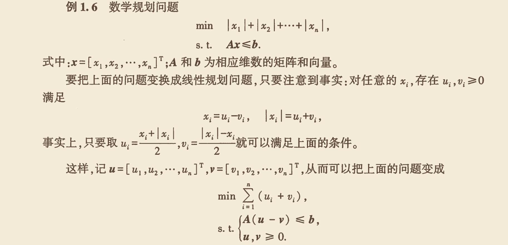
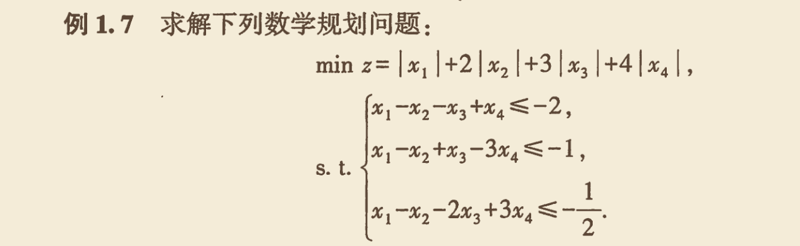

---

title: '线性规划'

publishDate: 'May 10, 2026'

updatedDate: 'May 10, 2026'

description: '线性规划概念以及算法实现'

tags:
- mathematics

- algorithm

- linear programming

language: 'Chinese'

heroImage: { src: 'rain.jpg', color: '#9698C1' }

---


## 引入
线性规划（linear programming, LP）是研究线性约束条件下线性目标函数最值问题的方法总称，是运筹学的一个分支，在多方面均有应用．线性规划的某些特殊情况，如网络流、多商品流量等问题都有可能在算法竞赛题目中出现．算法竞赛很少会出现只能用线性规划算法解决的问题，绝大多数这类问题可以通过网络流建模等方法更高效地解决．

## 例子
一个问题能够写成线性规划的形式，既要有若干个线性约束条件，又要有线性的目标函数．
早点师傅每天可以制作一定数量的包子和油条，这两种早餐深受顾客喜爱．为了最大化利润，师傅希望尽可能多地制作早点，但在实际操作中受到食材、时间等多种资源的限制．为此，师傅统计了制作每份早点所需的食材用量、制作时间及其对应的利润，具体如下表所示：

| 早点 | 植物油 | 面粉 | 时间 | 利润 |
| :--- | :--- | :--- | :--- | :--- |
| 包子 | 2 | 3 | 4 | 3 |
| 油条 | 3 | 2 | 2 | 2 |

假设师傅每天最多可以购入 66 单位的植物油和 60单位的面粉，并且最多可以投入 96单位的制作时间．那么，师傅应如何合理安排包子和油条的生产数量，才能使每天的利润最大化？

### 数学建模

设 $x_1 $ 为每天制作的包子数量，$ x_2 $ 为每天制作的油条数量．

**目标函数（最大化利润）：**
$$
\max \quad z = 3x_1 + 2x_2
$$

**约束条件：**

1. **植物油约束**：制作包子和油条所需的植物油总量不超过 66 单位
$$
2x_1 + 3x_2 \leq 66
$$

2. **面粉约束**：制作包子和油条所需的面粉总量不超过 60 单位
$$
3x_1 + 2x_2 \leq 60
$$

3. **时间约束**：制作包子和油条所需的总时间不超过 96 单位
$$
4x_1 + 2x_2 \leq 96
$$

4. **非负约束**：生产数量不能为负数
$$
x_1 \geq 0, \quad x_2 \geq 0
$$

综上，该问题的线性规划模型为：
$$
\begin{cases}
\max \quad z = 3x_1 + 2x_2 \\
\text{s.t.} \\
2x_1 + 3x_2 \leq 66 \\
3x_1 + 2x_2 \leq 60 \\
4x_1 + 2x_2 \leq 96 \\
x_1 \geq 0, \quad x_2 \geq 0
\end{cases}
$$


## 概念
一个线性规划问题$P$通常由如下两部分组成：

- 线性目标函数，即形如

$$f(x_1,x_2,\cdots,x_n)=c_1x_1+c_2x_2+\cdots+c_nx_n$$
的函数，其中$c_i\in\mathbf R$ 是常数；

- 线性约束，即形如

$$g_j(x_1,x_2,\cdots,x_n)=a_{j1}x_1+a_{j2}x_2+\cdots+a_{jn}x_n \le (=,\ge) b_j$$
的不等式或等式约束，其中$a_{ji},b_j\in\mathbf R$ 是常数．

线性规划问题，就是要在满足所给约束的前提下，最大化或者最小化目标函数．满足所给约束的解 (𝑥1,𝑥2,⋯,𝑥𝑛) ∈𝐑𝑛称为 可行解（feasible solution）；在所有可行解中，使得目标函数取得最值的解称为 最优解（optimal solution）．


## 解决方案与算法实践

### 环境准备

- 安装pulp库
```
pip install pulp
```
### 1.例子的代码实现（如上例）

```python
import pulp as lp   #导入线性规划库

print(lp.__version__)

# 创建最优化问题

Z=lp.LpProblem("max_profit",lp.LpMaximize)

# 定义变量
x1=lp.LpVariable("b_amount",lowBound=0,cat="Integer")
x2=lp.LpVariable("y_amount",lowBound=0,cat="Integer")

# 目标函数

Z+=3*x1+2*x2

# 约束条件

Z+=(2*x1+3*x2<=66,"constraint1")
Z+=(3*x1+2*x2<=60,"constraint2")
Z+=(4*x1+2*x2<=96,"constraint3")

# 求解器求解

Z.solve()

print("Status:",lp.LpStatus[Z.status])    #输出求解状态，一般分为最优、无解、无界、未知等

print("Optimal Value:",lp.value(Z.objective))   #输出最优解的目标函数值

print("Variable1:",x1.value()) #输出最优解的变量值1

print("Variable2:",x2.value())  #输出最优解的变量值2

```

### 说明

一般来说，应用这个库来解决线性规划问题的步骤可以分为以下几步：

- 建立线性规划模型，例如：Z=lp.LpProblem("max_profit",lp.LpMaximize)，这是一个数学建模对象，用于存储线性规划问题的所有信息（问题名称、最大化/最小化目标函数、约束条件等）。可以理解为线性规划问题的容器．

- 定义变量，例如：x1=lp.LpVariable("b_amount",lowBound=0,cat="Integer")，x2=lp.LpVariable("y_amount",lowBound=0,cat="Integer")，分别表示制作的包子数量和油条数量，取值为非负整数．其中每个变量接受的参数有四个，分别是变量名、下界、上界和变量类型（Integer，Continuous）．

- 定义目标函数，例如：Z+=3*x1+2*x2，表示最大化利润．

- 定义约束条件，例如：Z+=(2*x1+3*x2<=66,"constraint1")，表示制作包子和油条所需的植物油总量不超过 66 单位．其中，Z+=(表达式，约束名) 表示添加一个约束条件，表达式为约束条件的表达式，约束名为约束条件的名称．

- 求解模型，调用CBC求解器来求解。例如：Z.solve()，求解线性规划模型．

- 输出结果，我们一般要输出求解状态，目标函数值，变量值等。

### 2.带有绝对值的线性规划

原理：任一绝对值可以拆分为两个数相加，则可以转化为线性规划问题了。如图：


### 2.1 例子及代码实现



```python
import pulp as lp


model=lp.LpProblem("min_func",lp.LpMinimize)

# 定义变量

xp=lp.LpVariable.dicts("positive",range(4),lowBound=0)
xn=lp.LpVariable.dicts("negative",range(4),lowBound=0)


model+=(xp[0]+xn[0]+2*(xp[1]+xn[1])+3*(xp[2]+xn[2])+4*(xp[3]+xn[3]))

#原变量

x_vec=[xp[i]-xn[i] for i in range(4)]

#约束

model+=x_vec[0]-x_vec[1]-x_vec[2]+x_vec[3]<=-2
model+=x_vec[0]-x_vec[1]+x_vec[2]-3*x_vec[3]<=-1
model+=x_vec[0]-x_vec[1]-2*x_vec[2]+3*x_vec[3]<=-0.5

model.solve()


print("Status:",lp.LpStatus[model.status])
print("Optimal Value:",lp.value(model.objective))

print("Variables:")
for v in range(4):
    print(f"x_vec[{v}]:{x_vec[v].value()}")
```


### 参考文档
1.http://fancyerii.github.io/2020/04/18/pulp/（简单易懂）

2.https://coin-or.github.io/pulp/CaseStudies/index.html (官方文档)


