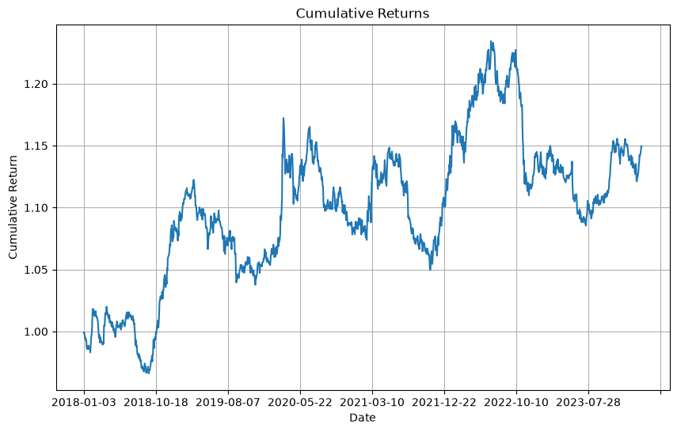
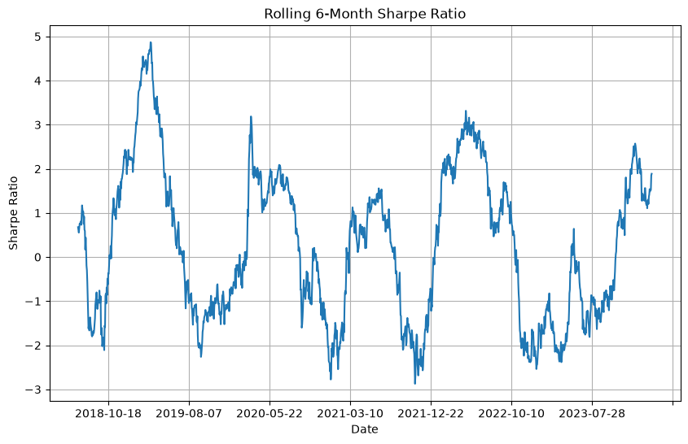
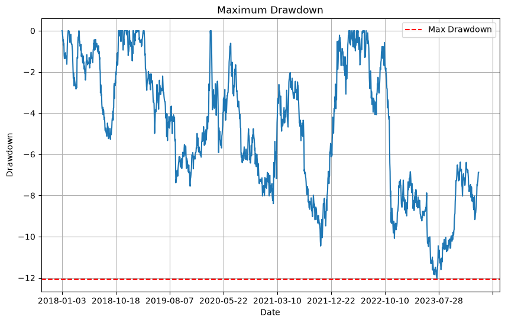

在金融和对冲基金领域，Long-Short Equity 策略通过同时建立多头（long）和空头（short）的股票头寸，来获取风险调整后收益并降低整体风险暴露。它不仅适合在市场上涨或下跌的环境中运用，还常被专业投资机构用来分散风险、获取超额收益。

## 理解Long-Short Equity 策略

Long-Short Equity 策略，顾名思义，就是通过买入（做多）被认为将上涨的股票，同时卖出（做空）被认为将下跌的股票，从而在市场不同时期的涨跌中都能获取收益，并尽量降低对整体市场波动的依赖。这与风险逆转策略不同，在风险逆转策略中，投资者同时买入看涨期权并且卖出看跌期权以此来模拟持有股票的情况。

比如一家对冲基金可能会卖空某家汽车行业的股票，同时买入另一家汽车行业的股票。例如，它可以卖空 100 万美元的戴姆勒-克莱斯勒股票，同时买入 100 万美元的福特股票。有了这样的持仓，无论发生什么导致整个汽车行业股票下跌的事件，戴姆勒-克莱斯勒股票的持仓都会获利，而福特股票的持仓则会遭受相应的损失。同样，无论发生什么导致这两家公司的股票价格上涨的事件——比如整个市场价格的上涨——对这些持仓的影响都微乎其微，甚至没有任何影响。

通过这种“多头+空头”的组合形式，即便市场整体下挫，多头部分可能会产生浮亏，但空头部分有望取得盈利，从而减小整体波动，增强组合的抗风险能力。

## 历史发展

Long-Short Equity 策略与对冲基金的历史紧密相连。从 20 世纪起，一些投资者便开始利用做多和做空来降低市场整体风险，同时赚取个股波动的差价。

- 20 世纪：对冲基金崛起
随着对冲基金的出现，机构投资者逐渐采用多空结合的方式，以在单个股票的差异化走势中获利。

- 20 世纪 50-60 年代：价值投资兴起
本杰明·格雷厄姆（Benjamin Graham）和沃伦·巴菲特（Warren Buffett）将“买入低估、卖出高估”的思想带入大众视野，奠定了 Long-Short 思路的基本面基础。

- 20 世纪 70-80 年代：量化模型出现
随着金融理论和计算机技术的发展，量化选股、统计模型等陆续被引入，诞生了更多依赖数学算法的多空策略。

- 20 世纪末至 21 世纪初
金融监管、市场竞争和金融工具的丰富，进一步推动了 Long-Short Equity 策略的多元化。如今，大数据、机器学习、人工智能等新技术，让多空策略持续演进。

## Long-Short Equity 基金分类

市场上的 Long-Short Equity 基金因投资理念和目标的不同，往往分为以下几类：

- 行业/板块型基金
专注于特定行业（如科技、医药、金融等），在同一行业内部同时做多和做空，以把握行业内部的估值差异。

- 市场中性型基金
保持多头和空头头寸在市值上的相对平衡（近似 0 净敞口），更强调捕捉个股之间的相对价值差，而非整体市场方向。

- 地域型基金
限定于某个国家或地区（如美国、欧洲、亚洲或新兴市场），基于本地市场的特点，同时做多和做空当地的股票组合。

## 构建一个Long-Short Equity 策略

一般而言，构建 Long-Short Equity 策略可分以下步骤：

1.确定股票池（Universe）
可以按市值、日均成交额、价格区间等维度筛选目标股票。

2.分行业或板块分类
将股票按行业分组（科技、医药、汽车、金融等），在同一板块或行业内做多空以减少系统性影响。

3.设置做多或做空的指标
根据历史数据或量化因子（如昨日涨跌幅、财务指标、技术指标等）进行排名，选择高排名做空、低排名做多，或结合均值回归、动量策略等原理。

4.资金分配（Capital Allocation）
最简单的做法是等权分配，也可依据市值、波动率或前期表现等进行差异化分配。

### 使用python 构建Long-Short Equity 策略

下面通过一段简单的 Python 代码示例来演示如何进行回测。示例选取了 38 家在纽约证券交易所上市的科技股，假设基于前一日涨跌幅进行排名，利用均值回归思路来做多空。

#### 获取数据
源数据从yfinance的API获取，数据范围为2018年1月1日至2024年3月1日。一般地，在获取到数据后，我们习惯于对此数据进行清洗和分析，一般通过数据处理库pandas的内置API（describe，head，isna等）来查看数据的基本信息和清洗异常值。

```python
import numpy as np
import pandas as pd
import matplotlib.pyplot as plt
%matplotlib inline
import yfinance as yf

# 读取 38 家科技股的历史数据

 tickers = ['AAPL', 'ACN', 'ADI', 'ADP', 'ADSK',  'APH', 'BABA', 'BIDU', 'BR', 'CRM',
           'FFIV', 'FIS', 'FISV','GOOG', 'GPN', 'IBM','INTC', 'INTU', 'IPGP', 'IT', 'JKHY', 
           'KEYS', 'KLAC', 'LRCX', 'MA', 'MCHP', 'MSFT','MSI', 'NVDA', 'NXPI', 'PYPL', 'SNPS', 
           'TEL', 'TTWO', 'TXN', 'V', 'VRSN']

data = yf.download(tickers, '2018-1-1', '2024-3-1')['Close']

data.to_csv('tech_stocks_2018_2024.csv')


# 读取保存的数据
data = pd.read_csv('tech_stocks_2018_2024.csv', index_col=0)

data.head()

```

#### 2.计算每日收益率
每日收益率的计算方法为：(当前价格 - 前一日价格) / 前一日价格。这里排名的作用在于做一个简单的多空判断，之后我们会讲到。需要注意的是排名是按行来进行，也就是不同股票之间，而非相同股票的不同交易日收益进行。

```python

daily_stock_returns = (data - data.shift(1)) / data.shift(1)

daily_stock_returns.dropna(inplace=True)

# 根据前一天的收益率进行降序排名
df_rank = daily_stock_returns.rank(axis=1, ascending=False, method='min')
```

#### 3.生成交易信号
这里生成信号的思想是简单的均值回归，也就是涨的多会下跌，跌的多的会上涨。接着我们会根据此来计算出此交易策略带来的收益。因为我们采取的是等权分配，所以这里计算平均收益是对所有收益的和除以股票数量来表示的。
```python
df_signal = df_rank.copy()
for ticker in tickers:
    # 排名靠前的做空 ( -1 )，排名靠后的做多 ( +1 )
    df_signal[ticker] = np.where(df_signal[ticker] < 22, -1, 1)

# 计算根据交易信号可能带来的下一日收益
returns = df_signal.mul(daily_stock_returns.shift(-1), axis=0)

# 对所有股票的收益做平均
strategy_returns = np.sum(returns, axis=1)/len(tickers)

```

#### 4.计算绩效指标：累积收益率，夏普比率，最大回撤

累积收益即为每日收益率相乘,但是因为cumprod方法的运行逻辑是连乘，所以这里要将每日收益率转化为每日净值倍数，即将收益率+1.

夏普比率是衡量策略的风险调整后收益的核心指标，计算公式为：
$$
Sharpe Ratio=\frac{\bar{r}-r_{f}}{\sigma}
$$
其中$\bar{r}$为策略的平均收益率，$r_{f}$为无风险利率，$\sigma$为策略的波动率（标准差）。这里因为我们计算的是策略的年化夏普比率，所以需要在原公式后乘上$\sqrt{252}$。

最大回撤是旨在衡量策略的最大下行风险，可以理解为任一高点到最低点的最大值，即为最大回撤。代码中cummax方法获取的是到目前为止的最高净值。如果用此时的净值减去当前为止的最大净值即为回撤，我们需要的是最大的回撤，那么就挑选最小的值即可。
```python
# 输出绩效指标：累计收益率，夏普比率，最大回撤

if not strategy_returns.empty:
    # 累计净值
    cumulative_returns = (strategy_returns + 1).cumprod()
    
    # 夏普比率 (假设无风险利率为 0)
    daily_rf_rate = 0
    annual_rf_rate = daily_rf_rate * 252
    strategy_volatility = strategy_returns.std() * np.sqrt(252)
    sharpe_ratio = (strategy_returns.mean()*252 - annual_rf_rate) / strategy_volatility

    # 最大回撤
    cum_max = cumulative_returns.cummax()
    drawdown = (cumulative_returns - cum_max) / cum_max
    max_drawdown = drawdown.min()*100

    # 收益率
    returns=(cumulative_returns.iloc[-1]-1)*100
    
    
    print("Cumulative Returns:")
    print(f"{returns:.2f}%")
    print("\nSharpe Ratio:")
    print(f"{sharpe_ratio:.2f}")
    print("\nMax Drawdown:")
    print(f"{max_drawdown:.2f}%")
else:
    print("No trades executed. Cannot compute performance metrics.")

```

#### 可视化指标
1. 绘制累计收益曲线
```python


import matplotlib.pyplot as plt

# 绘制累计收益曲线
if not strategy_returns.empty:
    cumulative_returns = (strategy_returns + 1).cumprod()
    plt.figure(figsize=(10, 6))
    cumulative_returns.plot()
    plt.title('Cumulative Returns')
    plt.xlabel('Date')
    plt.ylabel('Cumulative Return')
    plt.grid(True)
    plt.show()

```


2.绘制滚动夏普比率
用来衡量过去126天的夏普比率的变化。
```python
rolling_window = 126
rolling_sharpe_ratio = (strategy_returns.rolling(window=rolling_window).mean()*252 /strategy_returns.rolling(window=rolling_window).std()) * np.sqrt(252)

    
    plt.figure(figsize=(10, 6))
    rolling_sharpe_ratio.plot()
    plt.title('Rolling 6-Month Sharpe Ratio')
    plt.xlabel('Date')
    plt.ylabel('Sharpe Ratio')
    plt.grid(True)
    plt.show() 

```


3.绘制最大回撤曲线

```python
# 绘制最大回撤
plt.figure(figsize=(10, 6))
drawdown_ratio=drawdown*100
drawdown_ratio.plot()
plt.title('Maximum Drawdown')
plt.xlabel('Date')
plt.ylabel('Drawdown')
plt.axhline(max_drawdown, color='red', linestyle='--', label='Max Drawdown')
plt.legend()
plt.grid(True)
plt.show() 

```



## 排名机制（Ranking Scheme）在 Long-Short Equity 策略中的重要性

在本例中，我们采用前一日回报率来进行排名，并运用均值回归的思路。但在实盘中，可能结合其他指标（例如移动平均、成交量、财务指标等）综合评估，并决定使用动量还是均值回归。

例： 著名的 AQR 资本管理公司在构建其 QMJ（Quality Minus Junk）组合时，就会综合企业盈利能力、成长性、安全性等基本面指标来构造质量评分，再据此进行多空操作。

## 资金分配

在上文示例中，我们使用等权分配，将组合资金平均投入每只股票。除此之外，常见的还有：

基于市值加权：市值大的股票权重更高
基于波动率加权：波动更大的股票权重更低
基于因子加权：根据前期表现或因子分数分配权重

## 再平衡频率

高频再平衡：对短期策略而言，每日甚至每小时都要更新头寸，但会增加交易成本和滑点风险。
低频再平衡：中长期策略可能选择每周、每月或每季度再平衡，虽然交易成本更低，但也可能错失短期行情或加大对不利走势的敞口

## 总结

Long-Short Equity 策略常被对冲基金视为核心策略之一，通过同时做多和做空股票，投资者可以在市场涨跌中创造潜在收益并相对降低整体风险敞口。随着金融科技和数据分析工具的不断演进，Long-Short 策略也在不断迭代，从简单的价值与动量因子到复杂的机器学习模型，皆有其应用价值。